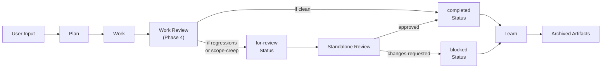

# Architecture Documentation

A bird's-eye view of the Arreio system design, boundaries, and codebase layout.

---

## 1. System Overview

- **Domain Problem**: AI-driven coding workflows are unpredictable and lack quality guardrails; Arreio transforms them into a deterministic, test-first software delivery pipeline.
- **Target Audience**: Developers and teams using agentic coding tools who want structured, reviewable, and repeatable development cycles.
- **Core Goal**: Provide an uncompromised, resilient harness for plan → work → review → learn execution.

## 2. Core Constraints (The "Don'ts")

- **No Ambiguous Plans**: Every plan must decompose into tasks with exactly one Acceptance Criterion each.
- **No Implementation Without Tests**: Tasks follow strict Red → Green → Refactor TDD discipline.
- **No Direct Cross-Skill Calls**: Skills are self-contained; orchestration happens through the agent harness, not skill-to-skill invocation.
- **No Undocumented Decisions**: Learnings, reviews, and plan deviations must be captured in persistent docs.
- **No Deep Inheritance in Skill Definitions**: Favor composition of micro-modules over monolithic skill files.

## 3. Technology Stack

| Layer             | Technology         | Primary Responsibility                                             |
| :---------------- | :----------------- | :----------------------------------------------------------------- |
| **Orchestration** | Agent Harness (pi) | Skill invocation, context management, user interaction             |
| **Skills**        | Markdown + YAML    | Self-describing workflow definitions and constraints               |
| **Modules**       | Markdown           | Reusable phase implementations within each skill                   |
| **Storage**       | Git (docs/)        | Persistent, versioned artifacts (plans, tasks, learnings, reports) |
| **Templates**     | Markdown           | Reference artifacts for consistent output formatting               |

## 4. Architectural Pattern & Data Flow

The system follows a **Pipeline Architecture**. Work flows unidirectionally through four core phases, each composed of deterministic micro-skills.



**Key Sequence:**

1. User runs `/work <plan-id>` → executes tasks Red → Green → Refactor
2. Work Review Phase 4 gates output:
   - Binary gate: if `regression-check: regressions-found` **OR** `scope-creep` findings exist → tasks enter `for-review` status
   - Else → tasks move to `completed` status
3. If `for-review` tasks exist, user runs `/review <work-id>`:
   - Standalone Review finds `status: for-review` tasks
   - Runs comprehensive audit (quality/security/tests/docs/integration)
   - Approval verdict updates task frontmatter:
     - `approved` → `status: completed`
     - `changes-requested` → `status: blocked` (with reason)
4. Learnings captured via `/learn` (orthogonal to approval gates; optional post-Review)

### Phase Pipelines

| Phase                 | Pipeline                                                   | Output Artifacts                                                                                     |
| --------------------- | ---------------------------------------------------------- | ---------------------------------------------------------------------------------------------------- |
| **Plan**              | Scope → Research → Design → Generate → Tasks               | `docs/plans/<plan-id>.md`, `docs/tasks/<plan-id>/`                                                   |
| **Work**              | Triage → Prepare → Execute → Review (with for-review gate) | Updated task files, code changes; tasks in `completed`, `for-review`, `blocked`, or `skipped` status |
| **Standalone Review** | Scope → Prepare → Analyze → Report                         | `docs/plans/.review/.report/<review-id>.md`; task status updates (task-in-review input)              |
| **Learn**             | Capture → Refine → Index (+ Maintain on-demand)¹           | `docs/learn/<category>/<learning>.md`                                                                |

¹ **Learn phases:** Capture → Refine → Index for normal authoring. Maintain (Phase 4) runs on-demand for dedup, refresh, prune, and legacy migration.

## 5. Codebase Map

```text
├── skills/                  # Core skill definitions
│   ├── arreio-init/         # Project initialization skill
│   │   ├── SKILL.md         # Skill contract and workflow
│   │   └── references/      # Templates (architecture, indexes)
│   ├── plan/                # Plan orchestration skill
│   │   ├── SKILL.md
│   │   ├── modules/         # Phase modules (scope, research, design, generate, tasks)
│   │   └── references/      # Templates and artifacts
│   ├── work/                # Work execution skill
│   │   ├── SKILL.md
│   │   ├── modules/         # Phase modules (triage, prepare, execute, review)
│   │   └── references/
│   ├── review/              # Code review skill
│   │   ├── SKILL.md
│   │   ├── modules/
│   │   └── references/
│   └── learn/               # Learning extraction skill
│       ├── SKILL.md
│       ├── modules/
│       └── references/
├── docs/                    # Persistent artifact storage
│   ├── plans/               # Plan artifacts
│   │   └── index.md         # Registry of all plans
│   ├── tasks/               # Task artifacts (per-plan subdirectories)
│   ├── learn/               # Extracted learnings
│   │   └── index.md         # Central knowledge base
│   ├── reports/             # Review reports
│   └── archives/            # Historical artifacts
├── ARCHITECTURE.md          # System design and architecture documentation
└── README.md                # Project overview
```

### Entry Points

- **Initialization**: `/arreio-init` — Bootstraps folder structure and indexes for a new project.
- **Planning**: `/plan <task description>` — Runs the full planning pipeline.
- **Execution**: `/work <plan-id>` — Executes task list for a plan.
- **Review**: `/review <input>` — Analyzes code changes.
- **Learning**: `/learn <input>` — Extracts and catalogs patterns.
- **Session End**: `/end-session` — Preserves context with a documented commit.

## 6. Component Design Philosophy

- **Thin Orchestrators**: Skill files (`SKILL.md`) define contracts and pipelines; they delegate all work to discrete modules.
- **Deterministic Phases**: Each module in a pipeline has a single, well-defined input/output contract with no fallback paths.
- **Self-Describing Artifacts**: Every generated document (plan, task, report, learning) carries front-matter metadata for discoverability.
- **Immutable References**: Templates and reference artifacts are versioned and never mutated in-place; downstream skills copy and fill them.

## 7. Operational Guidelines & Verification

- **Skill Validation**: Before modifying any `SKILL.md`, confirm its downstream modules and references still align with the contract.
- **Artifact Consistency**: All docs under `docs/` must use the metadata schema defined in `references/` templates.
- **Git Hygiene**: Run `/end-session` before closing a session to ensure state, decisions, and next steps are committed.
- **Index Maintenance**: After creating any plan, task, or learning, update the corresponding `index.md` so the knowledge graph remains traversable.

## 8. Design Decisions — Work Review & Standalone Review Integration (2026-08-12)

### Problem

Work executes tasks Red → Green → Refactor, then updates task status to `completed`. Standalone Review audits arbitrary code changes with a comprehensive quality/security/tests/docs/integration rubric. These are complementary but were architecturally adjacent (potential for duplication of scope-creep logic, inconsistent findings).

### Solution: Sequential Approval Gates via `for-review` Status

**Goals:**

1. Eliminate redundancy: Work Review is a lightweight pre-check; Standalone Review is the definitive approval gate
2. Make approval explicit: tasks cannot move to `completed` until Standalone Review approves
3. Decouple learnings from approval: the Learn skill is the single authoritative source for durable knowledge capture (orthogonal to approval gates)

**Implementation:**

1. **Work Review Phase 4** (lightweight pre-check):
   - Simplify, consolidate, run regression check (binary: any failure = gate blocks), detect scope-creep (any finding = gate blocks)
   - If `regression-check: regressions-found` **OR** `scope-creep` findings exist → tasks enter `status: for-review` (not `completed`)
   - Else → tasks move to `status: completed`
   - Surface learnings-to-capture for later `/learn` invocation (orthogonal to approval)

2. **Standalone Review** (definitive audit):
   - New input shape: **task-in-review** — accepts `/review <work-id>`, discovers `status: for-review` tasks
   - Runs full 4-phase audit (Scope → Prepare → Analyze → Report)
   - Report phase (new behavior): updates task file frontmatter based on approval verdict:
     - If `approved` → `status: completed`
     - If `changes-requested` → `status: blocked` (with reason)
   - Idempotent on `report-id`

3. **Learn Skill** (durable knowledge):
   - Receives learnings-to-capture from Work Report's Phase 5
   - User runs `/learn <work-id>` (or `/learn <candidate-ref>`) to persist learnings
   - Learn writes to `docs/learn/` (single source of truth for durable knowledge)
   - Orthogonal to approval gates — can run before/after Review

**Workflow:**

```
User runs /work <plan-id>
  ↓
Execute tasks (Red → Green → Refactor)
  ↓
Work Review Phase 4:
  - Simplify & consolidate
  - Regression check (any failure = gate)
  - Scope-creep detection (any finding = gate)
  - Learnings summary (for later /learn)
  ↓
If regression/scope-creep:
  - Tasks → status: for-review
  ↓
User runs /review <work-id>  (if for-review tasks exist)
  ↓
Standalone Review (full audit):
  - Scope → Prepare → Analyze → Report
  - Report updates task status:
    - approved → status: completed
    - changes-requested → status: blocked
  ↓
User runs /learn <work-id>  (optional; orthogonal to approval)
  ↓
Learn persists learnings to docs/learn/
```

**Rationale:**

- **Sequential, not parallel**: Decouples execution quality (Work Review) from approval authority (Standalone Review). No ambiguity about which skill approves.
- **Binary gates**: Work Review's gate is simple and fast (helps catch regressions early). Detailed severity assignment is Standalone Review's job.
- **Learnings orthogonal to approval**: Separates knowledge capture from gating, avoiding coupling. Learn skill remains the single source of truth.
- **Task status as API**: Task frontmatter `status:` field becomes the shared contract between Work and Review — no folder moves needed, paths stay stable.

**Trade-offs:**

- **User must run two skills**: `/work` then `/review` (if regressions/scope-creep detected). Adds a step. Mitigated by clear workflow documentation and optional automation via agent harness.
- **Two approval concepts**: Work's gate (regression/scope-creep) + Review's approval status (approved/changes-requested/rejected) could be confusing. Mitigated by renaming Work's gate outcome to avoid collision (using `task-status-target` internally; user sees `for-review` status).

### Status

- ✅ Phase 1 (define `for-review` status): Done (design)
- ✅ Phase 2 (update Work Review module): Done
- ✅ Phase 3 (update Review SKILL + task-in-review input): Done
- ✅ Phase 4 (update task index model, artifacts): In progress (work-report schema updated)
- ⏳ Phase 5 (error handling + quality gates): Pending implementation
- ⏳ Phase 6 (documentation + swimlane diagram): In progress
